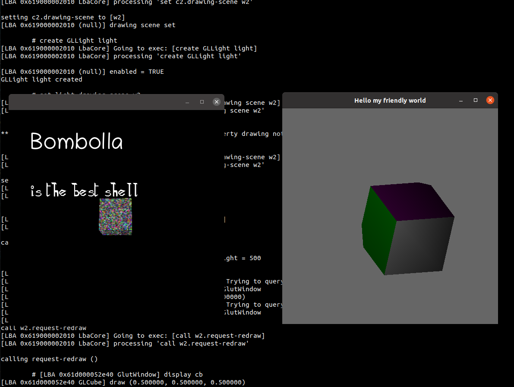

# bombolla


Bombolla is just a bunch of plugins used to play with the code and some technologies.
This project doesn't make sense at all actually.
But we do have some spinning cubes (almost).

## Building

```bash
sudo apt-get install -y libglib2.0-dev libsoup2.4-dev libpango1.0-dev libgjs-dev libpython3-dev automake pkg-config autopoint gtk-doc-tools libx11-xcb-dev freeglut3-dev libxfixes-dev libxdamage-dev libxcomposite-dev libxrandr-dev libglew-dev indent

git clone git@github.com:aslobodeniuk/bombolla.git

./autogen.sh

make install
```

## Running an example

```bash
build/bin/bombolla-shell -p build/lib/ -i examples/cogl
```
