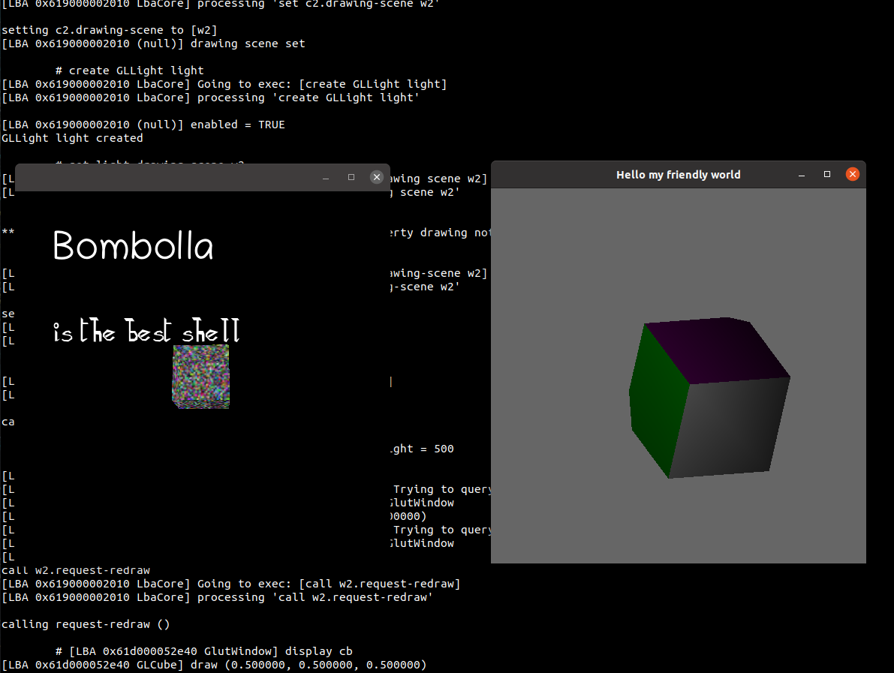

# bombolla


Currently bombolla is a space to play with technologies.
It is some kind of object-oriented shell/DSL that allows to manipulate plugins.


## Building

```bash
sudo apt-get install -qq libglib2.0-dev libsoup2.4-dev libgjs-dev libpython3-dev pkg-config indent valac ninja-build libcogl-pango-dev python3-pip python3-setuptools python3-wheel
sudo pip install meson

git clone git@ssh.gitlab.gnome.org:Sasha/bombolla.git
cd bombolla
./Firulais
```

## Running an example

```bash
build/bombolla/tools/shell/bombolla-shell -p build/bombolla/ -i examples/cogl
```

## Open the documentation of BMixin
```
./Firulais doc
```

## FAQ

### Can I write a plugin in python?

Yes, check
```bash
cat examples/plugin-in-python

LBA_PYTHON_PLUGINS_PATH=$(pwd)/examples/python build/bombolla/tools/shell/bombolla-shell -p build/bombolla -i examples/plugin-in-python
```

### ¿Can I call bombolla scripts from python?

Yes, check
```bash
cat examples/python/use-from-python.py
LBA_PLUGINS_PATH=build/bombolla/ python3 examples/python/use-from-python.py
```

### ¿Can I write a plugin in JavaScript?

Example 1 (Gtk 3)
```bash
build/bombolla/tools/shell/bombolla-shell -p build/bombolla -i examples/js/plugin-in-js-gtk3.lba
```
Example 2 (Gtk 4)
```bash
build/bombolla/tools/shell/bombolla-shell -p build/bombolla -i examples/js/plugin-in-js-gtk4.lba
```
Example 1 (pure GObject)
```bash
LBA_JS_PLUGINS_PATH=$(pwd)/examples/js/pure-gobject build/bombolla/tools/shell/bombolla-shell -p build/bombolla -i examples/js/pure-gobject.lba
```


### ¿Can I write a plugin in Vala?

Yes, check
```bash
LBA_PLUGINS_PATH=$(pwd)/examples/vala build/bombolla/tools/shell/bombolla-shell -p build/bombolla -i examples/plugin-in-vala
```

### So, ok I can write in many languages. Can I connect them in between?

Yes. There's a "Frankenstein" example, that parses an RSS feed with Python,
and then renders it through the UI written in JS.
Check [examples/frankenstein-news/frank.lba](examples/frankenstein-news/frank.lba) to see bombolla commands.
(Warning, Frankenstein example is still very rough, it doesn't parse the summary)
```bash
LBA_PYTHON_PLUGINS_PATH=$(pwd)/examples/frankenstein-news LBA_JS_PLUGINS_PATH=$(pwd)/examples/frankenstein-news build/bombolla/tools/shell/bombolla-shell -p build/bombolla/ -i examples/frankenstein-news/frank.lba
```
